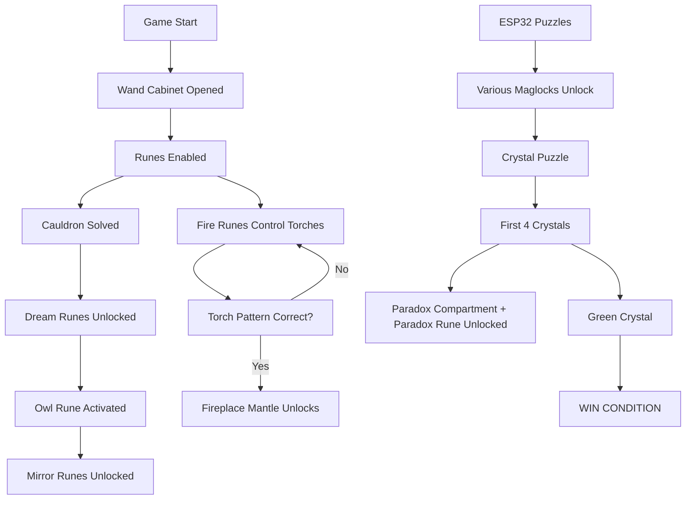

# Wizards Puzzle Reference Guide

## Game Flow Overview



## Detailed Puzzle Mechanics

### 1. Wand Cabinet (ESP32)
- **Trigger**: Door sensor activated
- **Action**: 
  - Publishes `escaperoom/esp32/wand_cabinet/opened`
  - Enables entire rune system
  - Unlocks wand cabinet maglock
- **Hardware**: Magnetic door sensor

### 2. Rune System (Rune Controller Pi)

#### Fire Runes (6 total)
- **5 Torch Runes**: Each controls one torch around the room
  - When activated via `/spell_success`: Turns corresponding torch ON/OFF
  - Required pattern for Fireplace Mantle: Torches 1,4 ON; Torches 2,3,5 OFF
- **1 Fireplace Rune**: Unlocks fireplace door when activated

#### Dream Runes (2 total) - **LOCKED until Cauldron solved**
- **Owl Rune**: 
  - Turns spotlight on
  - Plays audio via Windows machine
  - Turns spotlight off when audio completes (30s)
  - **UNLOCKS MIRROR RUNES when completed**
- **Rat Cage Rune**: 
  - Plays audio (10s)
  - Then unlocks rat cage maglock

#### Mirror Runes (2 total) - **LOCKED until Owl Rune completed**
- **Mirror 1 & 2**: Each activates backlight for respective mirror
- **Prerequisite**: Owl Dream Rune must be successfully activated first

#### Shadow Realm Rune (1 total)
- **Action**: 
  - Turns on all blacklights
  - Sends serial commands to sprite players

#### Paradox Rune (1 total) - **LOCKED until First 4 Crystals placed**
- **Action**: Sends serial commands to sprite players
- **Prerequisite**: RED, BLUE, PURPLE, WHITE crystals must be placed first

### 3. ESP32 Puzzle Systems

#### Cross/Purple Crystal (ESP32)
- **Input**: Button press
- **Output**: Unlocks purple crystal compartment maglock
- **MQTT**: `escaperoom/esp32/cross/pressed`

#### Cheese (ESP32)  
- **Input**: Sensor triggered
- **Output**: 
  - Plays cheese audio
  - Unlocks rat trap door maglock
- **MQTT**: `escaperoom/esp32/cheese/pressed`

#### Cauldron (ESP32)
- **Input**: Sensor triggered
- **Output**:
  - Sends serial command to sprite player
  - **UNLOCKS DREAM RUNES** globally
- **MQTT**: `escaperoom/gamestate/cauldron_solved`

#### Dials (ESP32)
- **Input**: Combination correct sensor
- **Output**: Unlocks treasure chest maglock
- **MQTT**: `escaperoom/esp32/dials/solved`

#### Staircase (ESP32)
- **Input**: 5 buttons (one per stair)
- **Interactive**: Each button cycles through 3 colors on NeoPixel sections
- **Solution**: Each stair must show correct color
- **Output**: Unlocks staircase compartment when solved
- **Hardware**: 80 NeoPixels (16 per stair)

#### Stone Crystals (ESP32) - **COMPLEX SEQUENCE**
- **Input**: 5 crystal placement sensors (RED, GREEN, BLUE, PURPLE, WHITE)
- **Logic**:
  1. First place RED, BLUE, PURPLE, WHITE (any order)
  2. When all 4 placed → Unlocks paradox compartment + GREEN crystal unlocked
  3. Then place GREEN crystal → **WIN CONDITION**
- **Removal**: Any crystal removed resets progress

#### Watcher Paintings (ESP32)
- **Input**: Alignment sensor
- **Output**: Unlocks associated maglock
- **MQTT**: `escaperoom/esp32/watcher/pressed`

### 4. Maglock Control System (Central Controller)

| Maglock | Trigger Condition |
|---------|------------------|
| **Paradox Compartment** | First 4 crystals placed |
| **Wand Cabinet** | Wand cabinet ESP32 triggered |
| **Purple Crystal Compartment** | Cross ESP32 triggered |
| **Rat Cage** | Dream rune (blue) activated |
| **Rat Trap Door** | Cheese ESP32 triggered |
| **Fireplace Mantle** | Torch pattern correct (1,4 ON; 2,3,5 OFF) |
| **Fireplace Door** | Fire rune (fireplace) activated |
| **Treasure Chest** | Dials ESP32 solved |
| **Staircase Compartment** | Staircase ESP32 solved |

## Game State Dependencies

### Critical Path 1: Dream → Mirror Rune Chain
```
Cauldron Solved → Dream Runes Unlocked → Owl Rune → Mirror Runes Unlocked
```

### Critical Path 2: Fireplace Mantle  
```
5 Fire Runes → Torch Control → Correct Pattern → Fireplace Mantle Unlock
```

### Critical Path 3: Crystal → Paradox Sequence
```
ESP32 Puzzles → 4 Crystals → Paradox Compartment + Paradox Rune Unlocked → Green Crystal → WIN
```

## Timing and Behaviors

### Rune Activation Sequence
1. **Button Press**: Rune activates (only if system enabled and no other rune active)
2. **Light Pulsing**: Every 2 seconds for 20 seconds (configurable)
3. **Timeout**: After 20 seconds, rune automatically deactivates  
4. **Success Trigger**: `/spell_success` HTTP endpoint during active period
5. **Actions**: Specific rune behavior executed, rune deactivates

### System Resets
- **Game Reset**: All maglocks lock, all states reset to initial
- **Maintenance Mode**: All maglocks unlock for access
- **Individual Resets**: Possible via Flask endpoints

## HTTP API Endpoints

### Rune Controller (Port 5001)
- `POST /spell_success` - Trigger active rune success
- `GET /status` - System status  
- `POST /reset` - Reset rune system

### Central Controller (Port 5002)
- `GET /status` - Complete system status
- `GET /maglocks` - All maglock states
- `POST /maglocks/{name}/unlock` - Manual unlock
- `POST /maglocks/{name}/lock` - Manual lock  
- `POST /reset` - Full system reset
- `POST /maintenance` - Toggle maintenance mode
- `POST /puzzle/{name}/solve` - Manual puzzle solve (testing)

## MQTT Message Flow

### ESP32 → Central Controller
```
escaperoom/esp32/wand_cabinet/opened → Unlock wand cabinet maglock
escaperoom/esp32/cross/pressed → Unlock purple crystal compartment  
escaperoom/esp32/cheese/pressed → Unlock rat trap door
escaperoom/esp32/dials/solved → Unlock treasure chest
escaperoom/esp32/staircase/solved → Unlock staircase compartment
escaperoom/esp32/crystals/first_four_placed → Unlock paradox compartment
escaperoom/esp32/crystals/all_placed → WIN CONDITION
escaperoom/esp32/watcher/pressed → Unlock maglock
```

### Rune Controller → Systems  
```
escaperoom/runes/fire/torch[1-5] → Control individual torches
escaperoom/runes/fire/fireplace → Unlock fireplace door maglock
escaperoom/runes/dream/spotlight → Control spotlight + audio
escaperoom/runes/dream/rat_cage → Unlock rat cage maglock  
escaperoom/runes/mirror/mirror[1-2] → Control mirror backlights
escaperoom/runes/shadow/realm → Control blacklights + sprites
escaperoom/runes/paradox/activate → Control sprite players
```

### System Control
```
escaperoom/system/reset → Reset entire game
escaperoom/system/maintenance → Maintenance mode
escaperoom/gamestate/cauldron_solved → Unlock dream runes
```

## Win Condition Sequence

1. **Trigger**: All 5 crystals placed (including GREEN after first 4)
2. **ESP32**: Publishes `escaperoom/esp32/crystals/all_placed`  
3. **Central Controller**: Receives message, triggers win sequence
4. **Actions**: 
   - Publishes `escaperoom/gamestate/win`
   - Could unlock final compartment
   - Celebration lighting/audio
5. **Game Complete**

## Troubleshooting Quick Reference

### Runes Not Working
- Check wand cabinet was opened first
- Verify no other rune is currently active
- **Dream runes**: Ensure cauldron has been solved
- **Mirror runes**: Ensure owl dream rune has been completed successfully
- **Paradox rune**: Ensure first four crystals (RED, BLUE, PURPLE, WHITE) have been placed
- Check MCP23017 I2C connections
- Look for GPIO conflicts

### MQTT Issues
- Verify broker running: `sudo systemctl status mosquitto`
- Check ESP32 WiFi connections
- Test with: `mosquitto_sub -t escaperoom/+/+`

### Maglocks Not Responding
- Check relay wiring and power
- Test manual unlock via HTTP API
- Verify GPIO pin assignments
- Check power supply capacity

### ESP32 Not Connecting
- Verify WiFi credentials
- Check MQTT broker IP address
- Monitor Serial output for errors
- Ensure adequate power supply